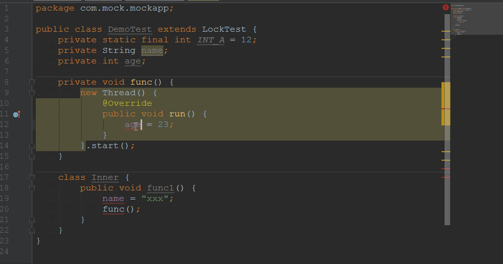

# Android 开发助手(Android DevKit)

## 功能

- 支持对送翻多语言进行一键同步操作；
- 支持对 Android res 下 string 的重复值静态检测及建议通过 @string/[duplicate] 替换；
- 支持对各种内部类直接访问外部类 private 属性建议修改为 protected 属性来减少一个 access$0 包装方法数；
- 支持对各种内部类直接访问外部类 private 方法建议修改为 protected 方法来减少一个 access$0 包装方法数；
- 支持配置常用网站便捷访问；

## 默认快捷键(可在 Setting 中修改) 

- 多语言同步：control alt 0
- 项目常用网站：control alt 1
- 安卓静态检测：control alt 2

## 操作演示

送翻前多语言重复性静态检查及纠正建议提示操作，譬如一个 string_i18n.xml 字符串文件中存在相同值的字符串，这对送翻来说是浪费人力财力。

<div></div>

送翻前多语言同步及格式化，方便给翻译公司提供 xml 文件，然后翻译后直接回来入库，避免出现意外。

<div></div>

对各种内部类直接访问外部类 private 属性和方法建议修改为 protected 来减少一个 access$0 包装方法数的操作。

<div></div>

项目相关常用网站 Android Studio 应用内快捷访问，提升开发效率。

<div></div>

## 注意事项

多语言源文件书写格式必须是标准 XML，一个完整的 `<string>xxxxx<string/>` 中必须不准换行，同步原理为按行同步，可以参照如下格式。

```xml
<resources>
    <string name="app_name">My Application</string>
    <string name="app_name1">@string/app_name</string>
    
    <!-- xxxxxx -->
    <array name="test">
        <item>xxix</item>
        <item>@string/app_name</item>
    </array>
</resources>
```

## 参考文档

[Android Developer Performance Tips: Consider Package Instead of Private Access with Private Inner Classes](https://developer.android.google.cn/training/articles/perf-tips.html#PackageInner)